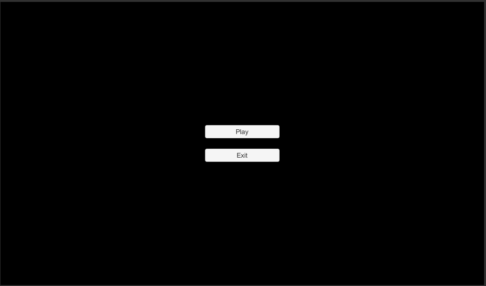

# Group Puzzle

## Game description
Game is 2D puzzle about completing levels by reaching goals using a group of non-unique units. Group control is achieved by creating-modifying behavior program and applying it to every member of a group. Program consists of a composition of (un)conditioned reactions to certain events and is set by player before playing each level and can only be modified between level-runs.

## Setup
Download code directory, merge its contents into fresh new project directory (Unity version 2018.4.22f1 or compatible), open project in editor, remove SampleScene. That should be enough.

## Gameplay overview
**Start menu**

**Level selection menu**

(Level number, name and goals completed or pending. Green star – mandatory goal, blue - optional)

**Level behavior programming menu**

1. trigger removal button (trigger is part of a program having event, zero or more conditions and one or more actions, zero actions possible, but trigger won’t do anything)
1. trigger adding button
1. event list (one per trigger, indicates under which circumstances actions will be performed, given that conditions are satisfied, changing current item in this list changes active event for the trigger)
1. condition adding button
1. condition list (select condition from the list, then add it by pressing button (4))
1. active condition (top left is description, bottom is parameters, if any, right – removal button)
1. action adding button
1. actions list (works same way as condition list)
1. active actions (works same way as active conditions)

**Level 1**

1. spawn point
1. units controlled by behavior program
1. goals for the level (star indicates type (green=mandatory, blue=optional), then text description and numbers to indicate goal progression)
1. finish

**Level menu + ending**

(level menu can be opened by pressing ESC or it will pop up upon completion or failing or mandatory goal. If you completed mandatory goal you can press “Continue” to wait if some optional goals will be finished. If you fail mandatory goal you cannot continue)

## Behavior program parts description
Behavior program consists of multiple triggers, each of which has 3 parts – event (upon which actions are to be performed), conditions (which are checked if event occurred and if satisfied – actions are performed) and actions.
For now, if conditions for one event are satisfied, then next events of the same types are skipped (once per frame).

Following events are available:
- Loop – event occurs every game frame, essentially processing it all the time.
- Collision – occurs when unit started or continues to collide with other unit or terrain.
- Falling started – occurs once when unit starts to fall.
- Landed – occurs once after unit started to fall when it collides with something with its bottom side.

Conditions:
- Group relation – condition checks if unit is or isn’t part of a group. Unit is part of a group when there is another unit in a vicinity (or more then 1 for Collision events).
- Collider type & side – checks what type is something unit is colliding with (other unit, terrain or both), and with what side unit is colliding with (top, sides (left/right), bottom, any). Condition is specific for collision event and ignored for others.

Actions:
- Move – move unit left or right
- Dash – dash to left/right/top/bottom once per timeout. Can’t be used in “Loop” event because basically it’s Move on steroids.
- Jump
- Switch direction – switch direction of Move action to the opposite. Can’t be used in “Loop” event.
- Toggle movement – forces move action to stop or start again or toggle depending on if it currently stopped or not. Works only if there is Move action somewhere.

## *code/Assets* directory overview
**Scenes**
- MainMenu.unity – scene for menus - main, level selection, behavior program changing.
- Level01-04.unity – levels scenes

**Images** – contains all svg images used in project imported using [“Vector Graphics” Unity package](https://docs.unity3d.com/Packages/com.unity.vectorgraphics@1.0/manual/index.html):
- arena.svg, loop_slide.svg, labyrinth.svg – terrain for 3 levels
- finish.svg – finish line, goal
- portal.svg – spawning point

**Materials**

**Prefabs**:
- LevelListItem.prefab – level selection menu list item;
- TriggerBlock.prefab – behavior program primary building block. Container for event, it’s conditions and actions;
- EventProperty.prefab – active condition/action block for an event;
- ParameterDropdown.prefab – dropdown for conditions/actions if they have list-type parameter;
- ParameterInputField.prefab – input field for conditions/actions if they have input-type parameter;
- Unit.prefab – prefab for units – main and only game characters, behavior of which we program;
- Spawner.prefab – where units spawn;
- Finish.prefab – where units have to go (if they have to);
- LevelEngine.prefab – contains settings for current level. Mandatory for each level scene.

**Scripts**

## Scripts details
- StartMenu.cs – basic script to control start/exit buttons and which menu (start, level selection or behavior) to display
- LevelMenu.cs – controls level selection menu (back or select level and change to behavior program menu), populates screen with available levels
- LevelListItem.cs – initializes level description for level selection menu
- ProgramMenu.cs – manages primary function for behavior program screen – back/start buttons, creating behavior triggers (event/conditions/actions container) and resetting previous behavior program, if we get to this menu from level selection menu.
- TriggerBlock.cs – behavior program primary building block. Manages initializing trigger with previous setting, changing event, adding conditions/actions, trigger removal.
- EditorAutoEdgeCollider.cs – if script is added in editor to GameObject containing line/sprite renderer (svg in our case) – generates basic “Edge Collider 2D” component according to object geometry.
- Spawner.cs – controls units spawning on timeout at GameObject position, resets counters and removes spawned units if player resets level from menu.
- StartMenu.cs – basic script to control start/exit buttons and which menu (start, level selection or behavior) to display
- LevelMenu.cs – controls level selection menu (back or select level and change to behavior program menu), populates screen with available levels
- LevelListItem.cs – initializes level description for level selection menu
- ProgramMenu.cs – manages primary function for behavior program screen – back/start buttons, creating behavior triggers (event/conditions/actions container) and resetting previous behavior program, if we get to this menu from level selection menu.
- TriggerBlock.cs – behavior program primary building block. Manages initializing trigger with previous setting, changing event, adding conditions/actions, trigger removal.
- EditorAutoEdgeCollider.cs – if script is added in editor to GameObject containing line/sprite renderer (svg in our case) – generates basic “Edge Collider 2D” component according to object geometry.
- Spawner.cs – controls units spawning on timeout at GameObject position, resets counters and removes spawned units if player resets level from menu.
- Finish.cs – controls if unit entered collision shape, in which case calls necessary functions of unit and levelengine.
- FinishPool.cs – controls when to show (and enable) finish objects. Specifically, which number of units should be left “alive” for finishes to show up.
- GameData.cs – contains all global game data such as levels, goals, events, conditions and actions classes definition and instances description, constants along with current state of a game – current level, behavior program, and finished goals.
  - Class Parameter – class for storing condition/action parameter description (for example list containing movement directions “left” and “right”)
  - class EventProperty – class for storing condition/action description (type, key, text describing it, parameters list)
  - class Event – contains key (name) + text (description) for events.
  - class Trigger – contains actual selected values of event and its conditions and actions values and their parameters according to behavior program.
  - class Goal – contains description of a level goal as a “text” field (and is_primary boolean) and a set of fields for conditions defining goal:
    - save – number of units that needs to reach finish to achieve the goal (-1 – inactive, 0 – all, 1+ - specific)
    - kill – number of units that needs to “die” to achieve the goal
    - group_min/group_max – total number of units that can be spawned for this goal to be achievable (not fully implemented)
    - time_limit – time limit in seconds
    - allowing_props – not implemented
    - cond_list/act_list – list of conditions in behavior program which can be used for this goal to be achievable (not implemented)
    
      And fields responsible for current state of goal, whether it’s finished, if we need to save units – how many saved, etc. And methods to track changes (OnUnitSaved, OnUnitDied, OnUpdate) and check if goal state changed (CheckResults) – if we failed already or if we can consider goal finished. Also “GetText” method for current goal state text representation and “Reset” if we restarted level.
  - class Level – contains description and current state of a level and its goals. Passes “OnUnitSaved”, “OnUnitDied”, “OnUpdate” events to goals which use them. Also resets goals if level restarted.
  - class GameData – global instance contains current game state and definitions of events, conditions, actions, levels and goals. New ones should be added here, in Awake method. Class fields:
    - level – current selected level id
    - events – dictionary of all available events for behavior programming
    - conditions/actions – as events for available conditions/actions
    - triggers – list of Triggers, represents current behavior program. Contains information about events/conditions|actions/parameters selected for the program.
    - levels – dictionary of all available levels (containing their descriptions, goals and current state)
- LevelEngine.cs – contains current level variables and wires together different parts of the level – pause menu, restarting, updating goal panels (and synchronizing goals with frame) and monitoring victory conditions. Class fields:
  - jump_speed – force of a jump
  - move_speedup – acceleration rate
  - dash_speed – force of a dash
  - dash_timeout – how much seconds has to pass for unit to be able to dash again.
  - max_velocity – max allowed speed (in our case – angular velocity)
  - group_size – total number of units to be spawned
  - simultaneous_max_group – maximum number of units that can be “alive” on screen (0 – any). Pauses spawning if reached.
- Unit.cs – controls each unit according to the behavior program performing all checks necessary for events/conditions and actions. Basically, everything defined in behavior program is implemented right here (also GroupCollision.cs, which is part of Unit.prefab). Class fields:
  - triggers – dictionary of lists of Triggers needed to separate behavior program events from each other to perform their processing more effectively.
  - current_collision – currently registered collision
  - sideDistance – distance from center of a unit to its sides (top, left, right, down). Used in collision side distinction.
  - group – other units from a group unit currently belongs to.

  Methods:
  - Reset – resets some values to default when player restarts level
  - IsCollidingWith – checks if unit is currently colliding with something (unit and/or terrain) from specific or any side.
  - Update – updates dash timer, checks if unit died by falling off level area, initiates processing of “Loop” events and “Falling started”/”Landed” events.
  - ConditionsSatisfied – checks if event conditions (if any) are satisfied
  - ProcessTrigger – runs actions if conditions are satisfied
  - RunActions – performs operations defined in selected actions
  - OnCollisionEnter2D/OnCollisionStay2D – initiates processing of “Collision” event
  - Death – invokes OnUnitDied event and destroys GameObject when if unit dies.
  - Finish – destroys when unit reaches finish line GameObject.
- GroupCollision.cs – checks if unit became part of a group or left one. Required for “Group relation” condition mechanics.

## Maintenance
Best way to modify existing levels is to open corresponding scene. You can change position and number of spawner/finishes, terrain, tweak or replace terrain with anything collidable, play with LevelEngine prefab instance inspector accessible variables to make some behavior program approaches stronger or weaker.
Level goals can be modified from GameData.cs script (GameData class, Awake method).

Same way if you want to create new level – define level and it’s goals in GameData.cs, create new scene and add it to unity build settings. Create some collidable terrain, one or more spawners, finish (If you want some of your units to survive). Add LevelEngine instance (also Event System and Directional Light) and voila. Level is ready.

To add new events/conditions/actions first you need to define them in GameData.cs. Then in Unit.cs (or required auxiliary child object/script) describe -how event occurs? How can condition be satisfied? What to do to perform action?

Goals can also be extended with additional requirements by modifying Goal class.

Overall, it turned out to be pretty hard task to come up with interesting behavior program mechanics and challenging levels at the same time. I believe that while there should be much more mechanics added levels should be challenging too, but primary goals should always be manageable for most levels. One easy goal and a few incrementally challenging or different to suggest player to test his skills.
